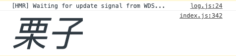

# beautiful-console  

beautiful-console 是一个美化浏览器控制台输出的库




## 安装
```shell
# npm
npm install --save beautiful-console

# yarn
yarn add beautiful-console
```

##使用

```javascript
import bc from 'beautiful-console'

const {beautify, console: {log: print}} = bc
print(beautify.blue('Hello world'))
```


对于原本的 `console.log` `console.warn` `console.error` `console.debug` `console.info` `console.groupCollapsed` `console.group` 都有封装
```javascript
import bc from 'beautiful-console'

const {beautify, console: {error: print}} = bc
print(beautify.blue('Goodbye world'))
```


